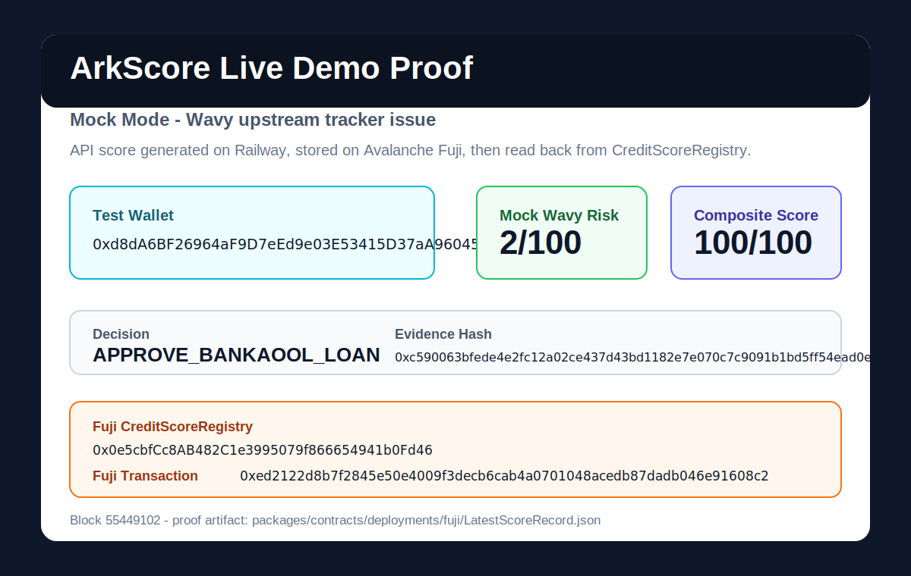

# ArkScore Pitch Deck

## Slide 1: The Pain (Arkangeles + Bankaool real challenges)

Arkangeles and Bankaool both need faster risk decisions without losing compliance evidence.

- Arkangeles needs investor and borrower screening before IFC-aligned equity issuance workflows.
- Bankaool needs alternative-data credit signals for thin-file and crypto-native customers.
- Today, wallet risk, compliance traceability, and underwriting decisions live in separate systems.
- Institutions need proof they can show: what was scored, what risk was found, who submitted it, and where the decision is stored.

## Slide 2: Solution (ArkScore one-liner)

ArkScore turns Wavy Node wallet risk into an explainable institutional credit score and stores the evidence on Avalanche Fuji.

- Input: an EVM wallet and institution context.
- Output: Wavy risk score, ArkScore composite score, decision bucket, subject hash, evidence hash, and on-chain registry proof.
- Built for two first workflows: Arkangeles IFC equity screening and Bankaool credit underwriting.

## Slide 3: Live Demo (include live links + screenshot of proof)

- Live frontend: [https://arkscore-seven.vercel.app](https://arkscore-seven.vercel.app)
- Live backend: [https://arkscore-api-production.up.railway.app](https://arkscore-api-production.up.railway.app)
- OpenAPI: [https://arkscore-api-production.up.railway.app/openapi.json](https://arkscore-api-production.up.railway.app/openapi.json)
- Fuji registry: [0x0e5cbfCc8AB482C1e3995079f866654941b0Fd46](https://testnet.snowscan.xyz/address/0x0e5cbfCc8AB482C1e3995079f866654941b0Fd46#code)
- Fuji proof transaction: [0xed2122d8b7f2845e50e4009f3decb6cab4a0701048acedb87dadb046e91608c2](https://testnet.snowscan.xyz/tx/0xed2122d8b7f2845e50e4009f3decb6cab4a0701048acedb87dadb046e91608c2)
- Proof artifact: `packages/contracts/deployments/fuji/LatestScoreRecord.json`

Demo result: wallet `0xd8dA6BF26964aF9D7eEd9e03E53415D37aA96045` received mock Wavy risk `2/100`, composite score `100/100`, and decision `APPROVE_BANKAOOL_LOAN`; the score was written to Fuji block `55449102` and verified by readback.

## Slide 4: Why Avalanche + eERC20 privacy

Avalanche gives ArkScore the settlement layer for institutional proof, while eERC20 is the privacy path for future credit assets.

- Fuji registry provides a public, auditable proof of scoring decisions without exposing the raw scored wallet on-chain.
- ArkScore stores a backend-derived `subjectHash`, Wavy analysis id, evidence hash, risk score, composite score, decision, institution, timestamp, and submitter.
- Avalanche is fast and low-cost enough for per-query institutional scoring proofs.
- eERC20 / EncryptedERC is the next layer: confidential credit notes or eligibility tokens tied to a score without revealing sensitive borrower details.

## Slide 5: Wavy Node Integration (mention mock mode due to temporary upstream issue)

ArkScore integrates Wavy Node as the risk and traceability source.

- Backend supports Wavy address registration, investigation creation, and `scan-risk` retrieval for Avalanche chain `43114`.
- API response preserves Wavy traceability as first-class data: provider, network, scan type, risk score scale, transaction count, patterns count, and analysis id.
- The Fuji proof stores the Wavy evidence hash and analysis id alongside the institutional decision.
- Current submission proof is clearly labeled mock mode because Wavy Node's upstream tracker returned `tracker-service::analyze: fetch failed`.
- Mock mode is deterministic and evidence-hashed, proving the API-to-contract path while Wavy upstream recovers.

## Slide 6: Market & Business Model (per-query SaaS)

ArkScore is a per-query risk and credit scoring SaaS for regulated fintech workflows.

- Target buyers: crowdfunding platforms, digital banks, lending desks, tokenized asset issuers, and compliance teams.
- Pricing: per wallet score, per on-chain proof, and enterprise plan for custom thresholds and reporting.
- Expansion: institution-specific decision rules, recurring monitoring, webhook alerts, batch scoring, and private eERC20 eligibility tokens.
- Why now: LatAm fintechs need crypto-aware underwriting, but they also need compliance-grade audit trails.

## Slide 7: Traction-ready / next steps

The MVP is live and ready for pilot conversations.

- Shipped: Vercel frontend, Railway API, Fuji contract, verified contract source, on-chain proof artifact, readiness scripts, and judge-facing README.
- Next: switch Railway back to live Wavy mode once tracker-service recovers, run a live Wavy-backed `record:fuji`, and redeploy Vercel with final public env values.
- Next: deploy optional EncryptedERC / eERC20 demo contract and connect the dashboard privacy card.
- Next: add institution admin settings for score thresholds, authorized scorers, and report exports.

## Slide 8: Team

ArkScore was built as a focused hackathon product: institution-first UX, working infrastructure, and verifiable evidence.

- Product: institutional scoring for Arkangeles and Bankaool use cases.
- Engineering: Next.js, Railway Express API, Wavy Node adapter, Hardhat, Solidity, Avalanche Fuji, wagmi, viem, and evidence-hash verification.
- Security posture: no secrets in artifacts, backend-derived subject hashes, authorized scorer writes, and generatedAt-bound proof validation.
- Submission stance: transparent about Wavy upstream status, with the full API-to-Fuji proof live and reproducible.
